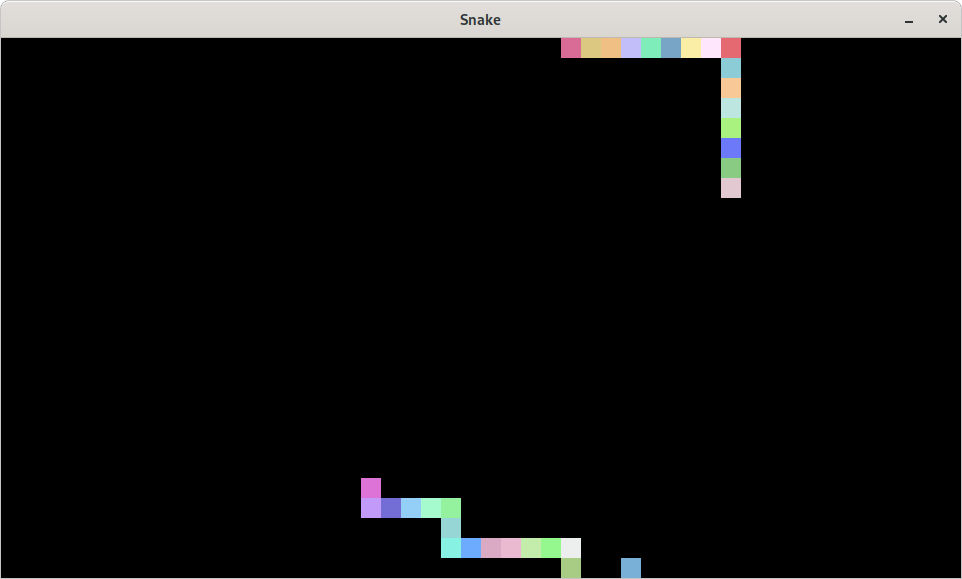

# vkSnake
This is very simple and primitive Snake game written with Vulkan and SDL2. After taking some basic steps in Vulkan thanks to [vulkan-tutorial.com](https://vulkan-tutorial.com/) and [vkguide.dev](https://vkguide.dev/) tutorials I wanted to write something that at least provide some substitute of game written in Vulkan. It also uses [vk-bootstrap](https://github.com/charles-lunarg/vk-bootstrap) and [VulkanMemoryAllocator](https://github.com/GPUOpen-LibrariesAndSDKs/VulkanMemoryAllocator).

